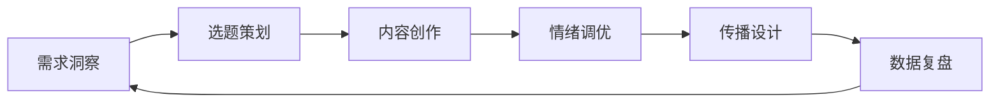

# 认知博主流量思维建模框架
## 从分析到爆款的系统化方法论

## 一、模型架构总览

### 1.1 三层建模体系
```
数据层（What）          分析层（Why）         执行层（How）
    ↓                      ↓                    ↓
内容数据采集  →  需求与流量关系分析  →  选题创作优化
博主特征提取  →  传播机制解构      →  内容策略制定
受众行为追踪  →  情绪触发点识别    →  增长飞轮构建
```

### 1.2 核心公式
**流量 = f(需求强度, 情绪触发, 传播机制, 时机把握)**

其中：
- 需求强度 = 痛点深度 × 受众规模 × 解决紧迫性
- 情绪触发 = 共鸣度 × 争议性 × 身份认同
- 传播机制 = 社交货币 × 公开性 × 故事性
- 时机把握 = 热点相关 × 发布节奏 × 平台算法

## 二、博主分析维度模型

### 2.1 内容基因解码
```yaml
核心维度:
  价值观输出:
    - 主流/反主流
    - 积极/批判
    - 理想/现实
  
  内容风格:
    - 语言特征: [口语化程度, 攻击性, 亲和力]
    - 叙事模式: [第一人称, 案例驱动, 理论讲解]
    - 情绪基调: [愤怒, 希望, 焦虑, 认同]
  
  知识结构:
    - 专业深度: 1-10分
    - 跨界广度: 1-10分
    - 实用程度: 1-10分
```

### 2.2 受众画像模型
```yaml
人群特征:
  基础属性:
    - 年龄段: [18-22, 22-25, 25-30]
    - 教育背景: [普通本科, 985/211, 专科]
    - 家庭背景: [普通家庭, 小康, 贫困]
  
  心理特征:
    - 核心焦虑: [就业, 学历, 阶层, 经济]
    - 价值追求: [成功, 认同, 安全, 自由]
    - 行为模式: [从众, 叛逆, 独立]
```

## 三、流量预测模型

### 3.1 选题评分算法
```python
def calculate_traffic_potential(topic):
    """
    流量潜力评分算法
    """
    # 基础分值计算
    pain_point_score = topic.pain_intensity * topic.audience_coverage
    emotion_score = topic.resonance * topic.controversy
    value_score = topic.practical_value + topic.cognitive_value
    
    # 加权系数
    weights = {
        'pain_point': 0.4,
        'emotion': 0.3,
        'value': 0.2,
        'timing': 0.1
    }
    
    # 时效性加成
    timing_bonus = 1.5 if topic.is_hot_topic else 1.0
    
    final_score = (
        pain_point_score * weights['pain_point'] +
        emotion_score * weights['emotion'] +
        value_score * weights['value']
    ) * timing_bonus
    
    return {
        'score': final_score,
        'level': get_traffic_level(final_score),
        'suggestion': get_optimization_suggestion(topic, final_score)
    }
```

### 3.2 流量等级划分
```
S级（爆款）: 90-100分
├── 特征：全网传播，破圈效应
└── 案例：重大社会议题+完美时机

A级（高流量）: 70-90分
├── 特征：目标圈层广泛传播
└── 案例：戳中普遍痛点+情绪共鸣

B级（中流量）: 50-70分
├── 特征：固定受众群体传播
└── 案例：垂直领域深度内容

C级（基础流量）: 30-50分
├── 特征：粉丝圈层内传播
└── 案例：日常内容更新
```

## 四、内容创作策略矩阵

### 4.1 选题策略四象限
```
        高需求匹配
            ↑
    [核心区]    [机会区]
    日常主力     热点结合
    深度内容     快速响应
←低流量潜力    高流量潜力→
    [维护区]    [引流区]  
    粉丝互动     破圈尝试
    社群运营     争议话题
            ↓
        低需求匹配
```

### 4.2 内容生产SOP


## 五、情绪触发机制模型

### 5.1 情绪进阶路径
```
Level 1: 注意力捕获
├── 标题党技巧
├── 视觉冲击
└── 开篇悬念

Level 2: 情绪唤起
├── 痛点直击
├── 身份认同
└── 价值观冲突

Level 3: 深度共鸣
├── 故事代入
├── 经历映射
└── 情感宣泄

Level 4: 行动转化
├── 评论互动
├── 转发分享
└── 持续关注
```

### 5.2 情绪组合策略
```yaml
高效组合:
  愤怒+希望: 
    效果: 先破后立，给出方向
    适用: 社会不公议题
  
  焦虑+安慰:
    效果: 共情+疗愈
    适用: 压力缓解内容
  
  自卑+认同:
    效果: 群体归属感
    适用: 身份标签内容
  
  好奇+满足:
    效果: 知识获得感
    适用: 科普解密内容
```

## 六、传播优化模型

### 6.1 病毒系数计算
```
K = i × p × c

K: 病毒传播系数
i: 初始受众的分享意愿（0-1）
p: 分享成功转化率（0-1）
c: 每次分享覆盖人数

当K>1时，内容具备病毒传播潜力
```

### 6.2 传播节点设计
```yaml
关键节点:
  发布时机:
    - 工作日: 12:00-13:00（午休）, 20:00-22:00（晚高峰）
    - 周末: 10:00-11:00（早高峰）, 21:00-23:00（睡前）
  
  引爆点设置:
    - 评论区互动: 预设讨论话题
    - KOL转发: 提前沟通合作
    - 社群预热: 核心粉丝先行
  
  二次传播:
    - 金句提炼: 便于截图传播
    - 观点总结: 降低理解门槛
    - 表情包化: 增加趣味性
```

## 七、数据驱动优化体系

### 7.1 关键指标体系
```yaml
流量指标:
  - 曝光量: 推荐展示次数
  - 点击率: CTR = 点击/曝光
  - 完播率: 完整观看比例

互动指标:
  - 点赞率: 点赞/播放
  - 评论率: 评论/播放
  - 分享率: 分享/播放
  - 关注转化率: 新增关注/播放

质量指标:
  - 评论深度: 平均评论字数
  - 二次创作: 引用、模仿数
  - 长尾流量: 30天后流量占比
```

### 7.2 A/B测试框架
```python
def ab_test_framework(variant_a, variant_b):
    """
    内容A/B测试框架
    """
    test_dimensions = {
        '标题对比': ['直接vs委婉', '疑问vs陈述'],
        '开篇对比': ['痛点vs故事', '数据vs情绪'],
        '结构对比': ['总分总vs递进', '并列vs对比'],
        '情绪对比': ['理性vs感性', '积极vs批判']
    }
    
    results = {}
    for dimension, options in test_dimensions.items():
        results[dimension] = compare_performance(
            variant_a[dimension],
            variant_b[dimension]
        )
    
    return optimize_based_on_results(results)
```

## 八、实战工具箱

### 8.1 选题灵感生成器
```python
def generate_topic_ideas(audience_profile, trending_topics):
    """
    基于受众画像和热点生成选题
    """
    templates = [
        "[痛点] + [人群] + [解决方案]",
        "为什么[A现象]会导致[B结果]",
        "[群体]必须知道的[数字]个[技能/真相]",
        "从[起点]到[终点]的[时间]逆袭之路"
    ]
    
    topics = []
    for template in templates:
        topic = fill_template(template, audience_profile, trending_topics)
        score = calculate_traffic_potential(topic)
        topics.append((topic, score))
    
    return sorted(topics, key=lambda x: x[1], reverse=True)[:10]
```

### 8.2 内容优化检查清单
```markdown
## 发布前检查清单

### 标题优化
- [ ] 是否包含目标关键词
- [ ] 是否有情绪触发点
- [ ] 是否制造信息差
- [ ] 字数是否在15-30字最佳区间

### 内容结构
- [ ] 开篇30秒是否吸引人
- [ ] 是否每3-5句有一个小高潮
- [ ] 是否有2-3个记忆点
- [ ] 结尾是否引导互动

### 情绪设计
- [ ] 是否激发目标情绪
- [ ] 情绪递进是否自然
- [ ] 是否提供情绪出口
- [ ] 是否强化身份认同

### 传播机制
- [ ] 是否提供社交货币
- [ ] 是否便于分享传播
- [ ] 是否设置讨论话题
- [ ] 是否预埋二次创作点
```

## 九、增长飞轮模型

### 9.1 内容增长飞轮
```
优质内容 → 流量增长 → 数据反馈 → 优化迭代 → 优质内容
    ↓           ↓           ↓           ↓
粉丝沉淀   广告变现   算法推荐   能力提升
```

### 9.2 生态构建路径
```yaml
阶段一（0-10万粉丝）:
  重点: 找准定位，打造爆款
  策略: 高频试错，快速迭代
  
阶段二（10-50万粉丝）:
  重点: 巩固人设，建立壁垒
  策略: 深度内容，社群运营
  
阶段三（50-100万粉丝）:
  重点: 破圈传播，IP化运营
  策略: 跨界合作，多元变现
  
阶段四（100万+粉丝）:
  重点: 生态构建，持续进化
  策略: 平台化运营，赋能他人
```

## 十、风险控制与可持续发展

### 10.1 内容风险管理
```yaml
风险类型:
  平台风险:
    - 算法调整
    - 政策变化
    - 竞争加剧
  
  内容风险:
    - 价值观偏差
    - 事实错误
    - 版权问题
  
  运营风险:
    - 人设崩塌
    - 粉丝流失
    - 变现困难

应对策略:
  - 多平台布局，降低依赖
  - 建立审核机制，确保质量
  - 保持真实，长期主义
```

### 10.2 可持续发展模型
```
核心竞争力 = 独特视角 × 专业深度 × 用户信任 × 持续创新

长期价值 = Σ(单次价值 × 复利效应 × 时间)
```

## 总结：流量思维的本质

流量不是目的，而是价值传递的结果。真正的流量思维是：

1. **深刻理解用户**：需求、痛点、情绪、行为
2. **创造真实价值**：解决问题、提供认知、情绪疗愈
3. **优化传播路径**：降低理解成本、提高分享动力
4. **持续迭代进化**：数据驱动、快速响应、长期积累

记住：**流量是价值的影子，追逐影子不如创造价值。**

---
*本框架基于大量实战数据和理论研究构建*
*建议结合具体场景灵活应用*
*Version 1.0 | 2025.01*