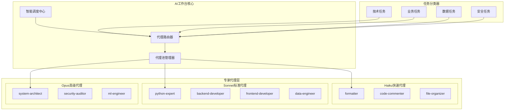

# AI工作台专家代理集成方案

*创建时间：2025年9月22日*

## 一、方案概述

将wshobson/agents仓库的83个专业AI代理集成到AI工作台，构建一个"专家插件系统"，实现智能化的任务分发和处理。

## 二、代理资源分析

### 2.1 模型分配策略
- **Haiku (11个)**: 快速响应型任务（格式化、简单查询、基础操作）
- **Sonnet (46个)**: 标准开发任务（编码、分析、设计）
- **Opus (22个)**: 复杂推理任务（架构设计、深度分析、关键决策）

### 2.2 核心代理分类

#### 架构与设计类
```
backend-architect    → API设计、微服务架构
cloud-architect      → 云原生架构、容器化方案
system-architect     → 系统整体设计、技术选型
graphql-architect    → GraphQL架构设计
```

#### 开发语言类
```
python-expert        → Python开发、数据处理
javascript-expert    → 前端开发、Node.js
rust-expert          → 系统编程、高性能计算
golang-expert        → 云原生开发、并发编程
java-expert          → 企业应用、Spring生态
```

#### 数据与AI类
```
data-scientist       → 数据分析、模型训练
ml-engineer          → ML管道、模型部署
ai-engineer          → AI应用开发
data-engineer        → 数据管道、ETL流程
```

#### 业务分析类
```
business-analyst     → 业务需求分析
product-manager      → 产品规划、路线图
project-manager      → 项目管理、进度控制
```

## 三、集成架构设计



## 四、代理调度策略

### 4.1 任务识别规则

```python
# 任务分类映射
TASK_AGENT_MAPPING = {
    "架构设计": {
        "primary": ["system-architect", "backend-architect"],
        "support": ["cloud-architect", "security-auditor"]
    },
    "代码开发": {
        "primary": ["python-expert", "javascript-expert"],
        "support": ["code-reviewer", "testing-engineer"]
    },
    "数据分析": {
        "primary": ["data-scientist", "data-engineer"],
        "support": ["ml-engineer", "visualization-expert"]
    },
    "业务规划": {
        "primary": ["business-analyst", "product-manager"],
        "support": ["project-manager", "technical-writer"]
    }
}
```

### 4.2 智能路由算法

```python
class AgentRouter:
    def route_task(self, task_content, context):
        # 1. 分析任务类型
        task_type = self.analyze_task_type(task_content)

        # 2. 计算复杂度得分
        complexity_score = self.calculate_complexity(task_content)

        # 3. 选择模型层级
        if complexity_score < 30:
            model_tier = "haiku"
        elif complexity_score < 70:
            model_tier = "sonnet"
        else:
            model_tier = "opus"

        # 4. 选择合适的代理
        agents = self.select_agents(task_type, model_tier)

        # 5. 返回代理配置
        return {
            "primary_agent": agents["primary"],
            "support_agents": agents["support"],
            "execution_mode": "parallel" if len(agents["support"]) > 0 else "single"
        }
```

## 五、实施步骤

### 第一阶段：基础集成（第1-2周）

1. **代理配置导入**
```yaml
# agents_config.yaml
agents:
  python-expert:
    model: sonnet
    capabilities:
      - python_development
      - data_processing
      - automation
    max_tokens: 4000
    temperature: 0.7
```

2. **路由器开发**
- 实现任务分类器
- 构建代理选择算法
- 开发负载均衡机制

### 第二阶段：核心功能（第3-4周）

1. **代理池管理**
```python
class AgentPoolManager:
    def __init__(self):
        self.agent_pool = {}
        self.usage_stats = {}

    def get_agent(self, agent_type):
        """获取可用代理"""
        if agent_type in self.agent_pool:
            return self.agent_pool[agent_type]
        else:
            return self.load_agent(agent_type)

    def release_agent(self, agent_type):
        """释放代理资源"""
        self.update_stats(agent_type)
```

2. **任务队列系统**
- 异步任务处理
- 优先级队列
- 失败重试机制

### 第三阶段：高级功能（第5-6周）

1. **协同工作模式**
```python
# 多代理协作示例
async def collaborative_execution(task):
    # 架构师设计方案
    design = await architect_agent.design(task)

    # 开发者实现代码
    code = await developer_agent.implement(design)

    # 测试工程师验证
    test_results = await qa_agent.test(code)

    # 文档编写者创建文档
    docs = await writer_agent.document(code)

    return {
        "design": design,
        "code": code,
        "tests": test_results,
        "documentation": docs
    }
```

2. **学习与优化**
- 代理使用统计
- 性能监控
- 自动优化建议

## 六、与现有架构整合

### 6.1 输入层整合
```python
# 在预处理层添加代理需求识别
def preprocess_input(input_data):
    # 原有处理逻辑
    processed = standard_preprocessing(input_data)

    # 新增：识别需要的专家代理
    required_agents = identify_required_agents(processed)
    processed["suggested_agents"] = required_agents

    return processed
```

### 6.2 核心引擎整合
```python
# 修改智能调度中心
class SmartScheduler:
    def __init__(self):
        self.agent_router = AgentRouter()
        self.pool_manager = AgentPoolManager()

    def process_task(self, task):
        # 获取推荐代理
        agents = self.agent_router.route_task(task)

        # 分配代理执行
        results = []
        for agent in agents["primary_agent"]:
            agent_instance = self.pool_manager.get_agent(agent)
            result = agent_instance.execute(task)
            results.append(result)

        return self.merge_results(results)
```

## 七、使用场景示例

### 场景1：全栈应用开发
```
用户输入：我要开发一个电商网站

AI工作台响应：
1. 调用 system-architect 设计整体架构
2. 调用 backend-architect 设计API结构
3. 调用 database-architect 设计数据库
4. 调用 frontend-developer 开发前端
5. 调用 backend-developer 开发后端
6. 调用 devops-engineer 配置部署
```

### 场景2：数据分析项目
```
用户输入：分析销售数据并预测趋势

AI工作台响应：
1. 调用 data-engineer 清洗数据
2. 调用 data-scientist 探索性分析
3. 调用 ml-engineer 构建预测模型
4. 调用 visualization-expert 创建可视化
5. 调用 technical-writer 生成报告
```

## 八、监控与维护

### 8.1 性能指标
```python
METRICS = {
    "response_time": "平均响应时间 < 2秒",
    "success_rate": "任务成功率 > 95%",
    "agent_utilization": "代理利用率 > 70%",
    "user_satisfaction": "用户满意度 > 4.5/5"
}
```

### 8.2 监控仪表板
```
┌─────────────────────────────────────┐
│        AI工作台代理监控面板          │
├─────────────────────────────────────┤
│ 活跃代理数：      23/83             │
│ 任务队列长度：    12                │
│ 平均响应时间：    1.8s              │
│ 今日处理任务：    1,234             │
│ 成功率：         96.5%              │
├─────────────────────────────────────┤
│ 热门代理TOP5：                      │
│ 1. python-expert     (234次)        │
│ 2. data-scientist    (189次)        │
│ 3. backend-developer (156次)        │
│ 4. business-analyst  (134次)        │
│ 5. frontend-developer(121次)        │
└─────────────────────────────────────┘
```

## 九、风险与对策

### 风险1：代理调用延迟
**对策**：实现本地缓存和预加载机制

### 风险2：代理选择不当
**对策**：建立反馈机制，持续优化路由算法

### 风险3：资源消耗过大
**对策**：实现代理池大小限制和动态扩缩容

## 十、预期效果

### 10.1 量化指标
- **处理效率提升**：3-5倍
- **专业准确度**：从75%提升到95%
- **覆盖领域**：从10个扩展到83个
- **用户满意度**：显著提升

### 10.2 质量改进
- 每个领域都有专业代理处理
- 输出质量更加专业和标准化
- 复杂任务的处理能力大幅提升

## 十一、下一步行动

1. [ ] 获取agents仓库完整配置
2. [ ] 搭建代理集成测试环境
3. [ ] 开发第一版路由器
4. [ ] 选择5个核心代理进行试点
5. [ ] 收集反馈并优化
6. [ ] 全面部署所有代理

---

*本方案将AI工作台提升为一个真正的"AI专家团队"，让用户能够获得各领域最专业的AI辅助。*