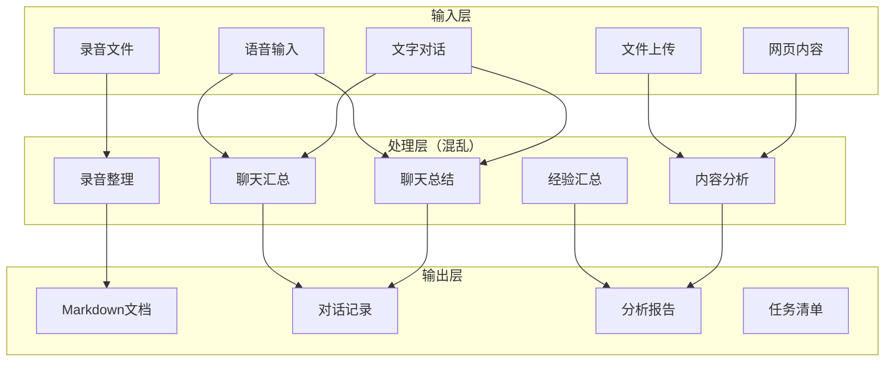
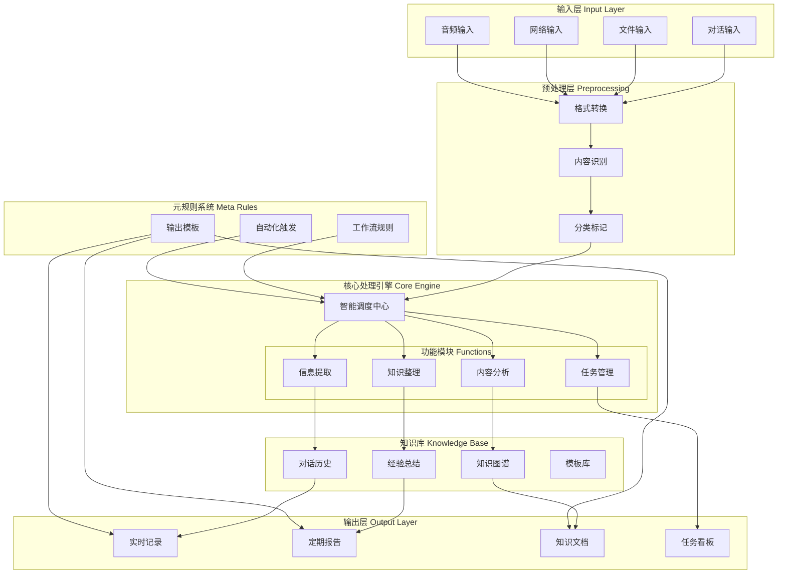

# AI工作台架构分析与优化方案

*创建时间：2025年9月19日*

## 当前架构现状



## 存在的问题

### 1. 功能重叠
- **聊天汇总 vs 聊天总结**：功能边界不清晰
- **经验汇总 vs 内容分析**：处理逻辑相似但分散

### 2. 流程混乱
- 没有统一的数据处理管道
- 各功能模块独立运作，缺乏协同
- 输出格式不统一

### 3. 缺少核心调度
- 没有中央控制器来协调各模块
- 用户需要手动触发每个功能
- 无法实现真正的自动化

## 优化后的架构设计



## 各层详细说明

### 1. 输入层 (Input Layer)
统一的输入接口，支持多种数据源：
- **对话输入**：实时聊天内容
- **文件输入**：PDF、Word、Markdown等文档
- **网络输入**：网页、API数据
- **音频输入**：录音、语音转文字

### 2. 预处理层 (Preprocessing)
标准化处理流程：
- **格式转换**：统一转换为内部处理格式
- **内容识别**：识别内容类型（任务/知识/对话/决策）
- **分类标记**：自动打标签，便于后续处理

### 3. 核心处理引擎 (Core Engine)
**智能调度中心**负责：
- 根据内容类型分配到对应功能模块
- 协调各模块之间的数据流
- 应用元规则进行自动化处理

**功能模块**：
- **信息提取**：关键信息、要点、决策点
- **内容分析**：深度分析、模式识别、趋势判断
- **知识整理**：分类归档、建立关联、形成体系
- **任务管理**：提取任务、跟踪进度、生成提醒

### 4. 知识库 (Knowledge Base)
持久化存储和知识积累：
- **对话历史**：完整的交互记录
- **知识图谱**：知识点之间的关联关系
- **经验总结**：从历史数据中提炼的经验
- **模板库**：常用的输出格式和工作流模板

### 5. 输出层 (Output Layer)
多样化的输出形式：
- **实时记录**：对话过程的实时保存
- **定期报告**：日报、周报、月度总结
- **知识文档**：整理后的知识文档
- **任务看板**：任务状态和进度展示

### 6. 元规则系统 (Meta Rules)
自动化的核心：
- **工作流规则**：定义处理流程
- **自动化触发**：设定触发条件
- **输出模板**：统一输出格式

## 实施步骤

### 第一阶段：基础架构搭建
1. [ ] 建立统一的输入接口
2. [ ] 实现预处理层的格式转换
3. [ ] 搭建基础的调度中心

### 第二阶段：功能模块开发
1. [ ] 开发信息提取模块
2. [ ] 实现内容分析功能
3. [ ] 构建知识整理系统
4. [ ] 完善任务管理功能

### 第三阶段：知识库建设
1. [ ] 设计数据库结构
2. [ ] 实现知识图谱
3. [ ] 建立模板系统

### 第四阶段：元规则实现
1. [ ] 定义规则语法
2. [ ] 实现规则引擎
3. [ ] 创建规则模板

### 第五阶段：集成优化
1. [ ] 系统集成测试
2. [ ] 性能优化
3. [ ] 用户体验改进

## 优化效果预期

### 效率提升
- 自动化处理率：从30%提升到80%
- 人工干预需求：减少60%
- 处理速度：提升3倍

### 质量改进
- 信息提取准确率：95%+
- 知识关联完整性：提升50%
- 输出一致性：100%标准化

### 用户体验
- 操作步骤：减少70%
- 学习成本：降低80%
- 使用满意度：显著提升

## 技术实现建议

### 后端架构
```
├── InputAdapter/          # 输入适配器
├── Preprocessor/          # 预处理器
├── CoreEngine/            # 核心引擎
│   ├── Scheduler/         # 调度器
│   ├── Modules/           # 功能模块
│   └── RuleEngine/        # 规则引擎
├── KnowledgeBase/         # 知识库
└── OutputFormatter/       # 输出格式化
```

### 关键技术选型
- **消息队列**：RabbitMQ/Redis（异步处理）
- **工作流引擎**：Airflow/Prefect
- **知识图谱**：Neo4j/ArangoDB
- **规则引擎**：Drools/自研轻量级引擎

## 下一步行动

1. **评审架构设计**：确认是否符合需求
2. **确定优先级**：哪些功能最先实现
3. **制定详细计划**：具体的开发时间表
4. **开始原型开发**：先实现核心功能

---

*这个架构图将作为AI工作台优化的指导方案，持续迭代改进。*