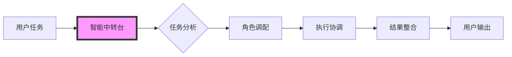

# AI智能中转台设计方案

*创建时间：2025年9月22日*

## 一、核心概念

**智能中转台**：一个能够理解用户任务、自动调配AI角色、协调多角色协作的智能调度系统。



## 二、中转台工作流程

### 2.1 任务接收与分析
```python
class TaskDispatcher:
    """智能中转台核心类"""

    def receive_task(self, user_input: str) -> TaskAnalysis:
        """
        接收并分析用户任务

        问题1：是否需要向用户确认理解的正确性？
        - 选项A：静默分析，直接执行
        - 选项B：复杂任务时请求确认
        - 选项C：始终显示分析结果供确认
        """

        # 意图识别
        intent = self.identify_intent(user_input)

        # 复杂度评估
        complexity = self.assess_complexity(user_input)

        # 领域识别
        domains = self.identify_domains(user_input)

        return TaskAnalysis(intent, complexity, domains)
```

### 2.2 动态角色调配

#### 基础映射规则
```yaml
task_role_mapping:
  # 单一角色任务
  simple_tasks:
    "代码格式化": [code-formatter]
    "写注释": [code-commenter]
    "查找bug": [debugger]

  # 多角色协作任务
  complex_tasks:
    "开发新功能":
      sequence:
        - business-analyst  # 需求分析
        - system-architect  # 架构设计
        - backend-developer # 后端开发
        - frontend-developer # 前端开发
        - qa-engineer       # 测试验证

    "性能优化":
      parallel:
        - performance-optimizer # 性能分析
        - database-expert      # 数据库优化
        - backend-developer    # 代码优化

    "数据分析项目":
      hybrid:  # 混合模式：部分并行，部分串行
        phase1: [data-engineer, data-scientist]  # 并行
        phase2: [ml-engineer]                    # 串行
        phase3: [visualization-expert, technical-writer] # 并行
```

**设计诉求1**：对于模糊的任务描述，我应该：
- A. 主动询问细节？
- B. 基于经验推测？
- C. 提供多个方案供选择？

### 2.3 执行模式设计

#### 模式1：串行执行
```python
async def serial_execution(self, roles: List[str], task: Task):
    """串行执行：前一个角色的输出是后一个的输入"""
    context = task.initial_context

    for role in roles:
        # 问题2：是否在每个角色切换时通知用户？
        print(f"🔄 切换到{role}角色处理...")

        result = await self.execute_with_role(role, task, context)
        context = self.merge_context(context, result)

        # 问题3：是否需要中间确认点？
        if self.needs_confirmation(result):
            if not self.get_user_confirmation(result):
                break

    return context
```

#### 模式2：并行执行
```python
async def parallel_execution(self, roles: List[str], task: Task):
    """并行执行：多个角色同时工作"""

    # 问题4：并行执行时如何处理冲突的建议？
    tasks = [
        self.execute_with_role(role, task)
        for role in roles
    ]

    results = await asyncio.gather(*tasks)

    # 结果整合策略
    return self.merge_parallel_results(results)
```

#### 模式3：自适应执行
```python
async def adaptive_execution(self, initial_role: str, task: Task):
    """自适应：根据执行结果动态调整"""

    current_role = initial_role
    context = task.initial_context

    while not self.task_completed(context):
        result = await self.execute_with_role(current_role, task, context)

        # 动态决策下一个角色
        next_role = self.decide_next_role(result, context)

        # 问题5：是否需要解释为什么切换角色？
        if next_role != current_role:
            print(f"📊 基于当前进展，切换到{next_role}")
            current_role = next_role

        context = self.merge_context(context, result)

    return context
```

## 三、角色协作模板

### 3.1 全栈开发模板
```python
template_fullstack = {
    "name": "全栈应用开发",
    "triggers": ["开发", "创建应用", "做个网站", "实现功能"],
    "workflow": [
        {
            "phase": "需求分析",
            "role": "business-analyst",
            "output": "需求文档",
            "user_checkpoint": True  # 需要用户确认
        },
        {
            "phase": "架构设计",
            "role": "system-architect",
            "output": "架构方案",
            "user_checkpoint": True
        },
        {
            "phase": "开发实现",
            "parallel": [
                {"role": "backend-developer", "output": "API代码"},
                {"role": "frontend-developer", "output": "UI代码"},
                {"role": "database-architect", "output": "数据库设计"}
            ],
            "user_checkpoint": False
        },
        {
            "phase": "测试部署",
            "sequence": [
                {"role": "qa-engineer", "output": "测试报告"},
                {"role": "devops-engineer", "output": "部署方案"}
            ],
            "user_checkpoint": True
        }
    ]
}
```

### 3.2 数据科学模板
```python
template_datascience = {
    "name": "数据科学项目",
    "triggers": ["分析数据", "预测", "机器学习", "数据挖掘"],
    "workflow": [
        {
            "phase": "数据准备",
            "role": "data-engineer",
            "output": "清洗后数据",
            "auto_proceed": True  # 自动继续
        },
        {
            "phase": "探索分析",
            "parallel": [
                {"role": "data-scientist", "output": "统计分析"},
                {"role": "visualization-expert", "output": "可视化"}
            ]
        },
        {
            "phase": "建模",
            "role": "ml-engineer",
            "output": "预测模型",
            "conditional": {
                "if": "需要预测",
                "else": "skip"
            }
        }
    ]
}
```

## 四、交互设计

### 4.1 自动模式
```python
# 用户输入
"帮我优化这个Python脚本的性能"

# 中转台响应
"""
📋 任务分析完成
- 任务类型：性能优化
- 调配角色：performance-optimizer, python-expert
- 执行模式：协作分析

🚀 开始执行...
[自动进行，最后输出结果]
"""
```

### 4.2 交互模式
```python
# 用户输入
"我要做一个电商网站"

# 中转台响应
"""
📋 任务分析
这是一个复杂的全栈开发任务，我建议采用以下方案：

阶段1：需求分析 (business-analyst)
阶段2：架构设计 (system-architect, database-architect)
阶段3：开发实现 (backend-developer, frontend-developer)
阶段4：测试部署 (qa-engineer, devops-engineer)

请选择执行方式：
A) 全自动执行所有阶段
B) 每个阶段完成后确认
C) 自定义流程

您的选择：[B]
"""
```

### 4.3 解释模式
```python
# 配置
dispatcher.explanation_mode = True

# 执行时
"""
🔍 分析您的任务...
- 检测到关键词：'性能'、'优化'
- 推测意图：改善代码执行效率
- 复杂度评估：中等（需要多角度分析）

🎯 角色调配决策：
- 选择 performance-optimizer 因为：专注性能分析
- 选择 python-expert 因为：提供语言特定优化
- 执行模式：并行分析后综合建议

是否按此方案执行？(Y/n)
"""
```

## 五、关键决策点

### 需要您的偏好设置：

1. **默认执行模式**
   - [ ] 静默自动（除非出错）
   - [ ] 关键节点确认
   - [ ] 详细解释模式

2. **角色切换通知**
   - [ ] 不通知
   - [ ] 简单提示
   - [ ] 详细说明原因

3. **结果呈现方式**
   - [ ] 整合后的统一输出
   - [ ] 分角色的独立输出
   - [ ] 带执行过程的完整报告

4. **错误处理策略**
   - [ ] 自动尝试其他角色
   - [ ] 暂停并请求指导
   - [ ] 记录并继续

5. **学习机制**
   - [ ] 记住任务偏好
   - [ ] 优化角色选择
   - [ ] 调整执行策略

## 六、实现优先级

### Phase 1：基础功能（第1周）
- [x] 任务意图识别
- [ ] 基础角色映射
- [ ] 串行执行模式

### Phase 2：进阶功能（第2周）
- [ ] 并行执行模式
- [ ] 结果整合机制
- [ ] 用户确认点

### Phase 3：智能化（第3周）
- [ ] 自适应执行
- [ ] 动态角色调整
- [ ] 学习优化

## 七、技术实现框架

```python
from enum import Enum
from typing import List, Dict, Optional
import asyncio

class ExecutionMode(Enum):
    SERIAL = "串行"
    PARALLEL = "并行"
    ADAPTIVE = "自适应"

class ConfirmationLevel(Enum):
    NONE = "无需确认"
    CRITICAL = "关键点确认"
    VERBOSE = "详细确认"

class IntelligentDispatcher:
    def __init__(self,
                 mode: ExecutionMode = ExecutionMode.SERIAL,
                 confirmation: ConfirmationLevel = ConfirmationLevel.CRITICAL):
        self.mode = mode
        self.confirmation = confirmation
        self.role_registry = self.load_agents()
        self.templates = self.load_templates()
        self.history = []

    async def process_task(self, user_input: str):
        """主处理流程"""
        # 1. 分析任务
        analysis = self.analyze_task(user_input)

        # 2. 选择执行策略
        strategy = self.select_strategy(analysis)

        # 3. 确认（如需要）
        if self.needs_confirmation(analysis):
            if not await self.get_confirmation(strategy):
                return None

        # 4. 执行
        result = await self.execute_strategy(strategy)

        # 5. 学习
        self.learn_from_execution(analysis, strategy, result)

        return result
```

## 八、需要您的反馈

**问题清单**：

1. **自主程度**：您希望中转台有多大的自主决策权？
   - 完全自主（信任AI判断）
   - 半自主（重要决策请示）
   - 指导式（每步确认）

2. **透明度**：您需要看到多少执行细节？
   - 只看结果
   - 看关键步骤
   - 看完整过程

3. **个性化**：是否需要记住您的偏好？
   - 是（学习您的习惯）
   - 否（每次独立处理）

4. **错误容忍**：当角色选择不当时？
   - 自动纠正
   - 请求帮助
   - 继续执行

---

*请告诉我您的偏好，我会据此调整中转台的设计。*